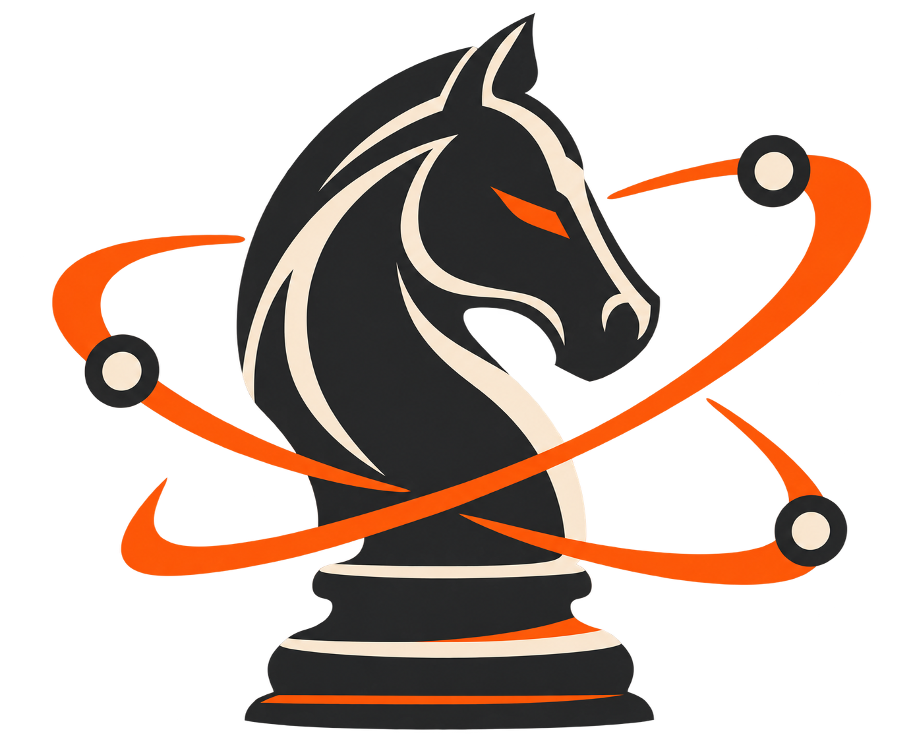

<p align="center">
  
</p>

# Chessed

[](https://github.com/quangshuynh/chessed/actions/workflows/ci.yml)
[](LICENSE)
[](https://www.typescriptlang.org/)

Chessed is an independent open-source web application for reviewing chess games.

> Chessed is **not affiliated with or endorsed by Chess.com**.

## Current status

This repository contains the initial MVP foundation:

- Responsive homepage with the primary flow: enter Chess.com username → find games → select game → review
- Chess.com public API integration for recent public games
- Manual PGN paste flow
- PGN parsing and move/position reconstruction (including custom FEN starts)
- Interactive review screen with explicit client-side analysis, progress, cancellation, ordinary move classifications, and selected-move engine evidence
- Deterministic, engine-evidence-based explanations of why the selected move received its review outcome
- Score-sheet move history grouped by FEN-aware fullmove number while preserving one-based ply identity for every interactive move
- Human-readable SAN best moves and position-aware, correctly numbered SAN principal variations
- Source-proven Chess.com player avatars with resilient Chessed fallbacks
- Optional Chessed-owned move, capture, check, and checkmate navigation sounds

The Stockfish analysis boundary, engine-independent move-quality observations, Chessed's ordinary move-classification policy, whole-game review orchestration, Chessed Accuracy, the evaluation graph, and deterministic move explanations are implemented. Estimated Performance was researched and rejected rather than deferred.

## MVP workflow

1. Enter a Chess.com username.
2. Load recent public games.
3. Select a game (or paste a PGN manually).
4. Open the review interface, optionally start analysis, and navigate move-by-move.

## Technology stack

- Next.js (App Router)
- React + TypeScript (strict mode)
- chess.js for PGN/chess rules handling
- react-chessboard for board UI
- ESLint + Prettier
- Vitest for unit tests
- Playwright for bounded real-browser Stockfish validation
- GitHub Actions for CI

## Local development

```bash
npm install
npm run dev
```

Open http://localhost:3000.

## Quality checks

```bash
npm run lint
npm run typecheck
npm run test
npm run build
npm run test:e2e
```

## High-level architecture

- `src/lib/sources/chesscom/*`: Chess.com retrieval service boundary
- `src/lib/chess/*`: chess-domain parsing and game representation
- `src/lib/review/interfaces.ts`: engine-independent normalized analysis contract
- `src/lib/review/move-quality.ts`: pure player-relative move-quality observations
- `src/lib/review/classification.ts`: pure ordinary move-classification policy
- `src/lib/review/game-review.ts`: pure whole-game review contract and composition
- `src/lib/review/move-explanation.ts`: pure deterministic move-explanation derivation
- `src/lib/analysis/*`: Stockfish worker adapter, UCI normalization, and serial game-position analysis
- `src/components/*`: UI presentation components
- `docs/images/chessed-logo.png`: transparent Chessed brand source; optimized derivatives live at `public/brand/chessed-logo.png` and `src/app/icon.png`
- `src/app/api/chesscom/[username]/games`: API boundary for Chess.com integration

Conceptual pipeline:

Chess.com/PGN → PGN parsing → chess positions → Stockfish analysis → Chessed review/classification → interactive UI

## Current limitations

- Review sessions are stored in browser session storage (no backend persistence)
- Chess.com games without PGN data cannot be opened
- Analysis is rerun after a page reload; there is no persistent analysis cache
- Move explanations render only retained engine evidence; they are not coaching, strategic analysis, or opening theory

### Scoring and explanation scope

- **Chessed Accuracy: implemented.** Per-player scores are computed and shown; see [the accuracy methodology](docs/accuracy-scoring.md).
- **Estimated Performance: evaluated and dropped.** A preregistered 480-game calibration found that a richer model did not beat an honestly fitted accuracy-only baseline on untouched holdout data, so `chessed-performance-v1` was never frozen. This is a rejected result, not deferred work; see [the performance research](docs/game-performance-research.md).
- **Deterministic move explanations: implemented.** Each selected move is explained from evidence the completed review already holds, with zero additional Stockfish work; see [deterministic move explanations](docs/move-explanations.md).

Stockfish runs client-side in a single-threaded WebAssembly Web Worker. The default limit is depth 12, and normalized evaluations are always from White's perspective. See [the analysis architecture](docs/stockfish-analysis.md).

Move-quality observations convert those scores centrally to the mover's perspective, preserve mate transitions without fake centipawn arithmetic, and represent terminal or missing analysis explicitly. See [the move-quality model](docs/move-quality.md).

Chessed classifies complete observations as Best, Good, Inaccuracy, Mistake, or Blunder with a documented outcome-expectation policy. See [the ordinary classification methodology](docs/move-classification.md).

Completed reviews also include independent per-player Chessed Accuracy scores,
derived continuously from preserved objective outcome rather than classification
labels. See [the accuracy methodology](docs/accuracy-scoring.md).

An injected analyzer produces one ordered, provenance-bearing result for a complete game, which the review page consumes without recreating chess or classification logic. See [whole-game review orchestration](docs/whole-game-review.md).

A completed review also drives an interactive evaluation graph that visualizes
the existing White-relative engine evidence across canonical game positions. It
runs no extra analysis and is not win probability. See
[the evaluation graph](docs/evaluation-graph.md).

Each selected move also carries a deterministic explanation derived only from
evidence the completed review already retains. It runs no extra Stockfish work
and never claims a chess concept the evidence cannot establish. See
[deterministic move explanations](docs/move-explanations.md).

Chess.com avatar provenance, fallback behavior, sound precedence, navigation
semantics, and the persisted mute preference are documented in
[player avatars and sounds](docs/player-avatars-and-sounds.md).

## Third-party libraries and attribution

- [chess.js](https://github.com/jhlywa/chess.js) (MIT)
- [react-chessboard](https://github.com/Clariity/react-chessboard) (MIT)
- [Stockfish.js 18](https://github.com/nmrugg/stockfish.js) (GPLv3; unmodified lite single-threaded build, with its license in `public/stockfish/Copying.txt`)

See `LICENSE` for this project license.
